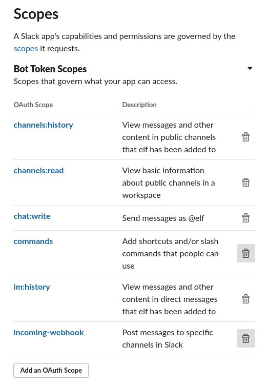

## configuration

enable:

* Incoming Webhooks

### Slash commands

| Command |          Request URL          |        Short description        |      Usage hint       | 
|---------|-------------------------------|---------------------------------|-----------------------|
| /test   | https://smee.io/CHANNEL_ID    | test elf and infra setup        |                       |

### OAuth & Permissions

at least these permissions must be added:

