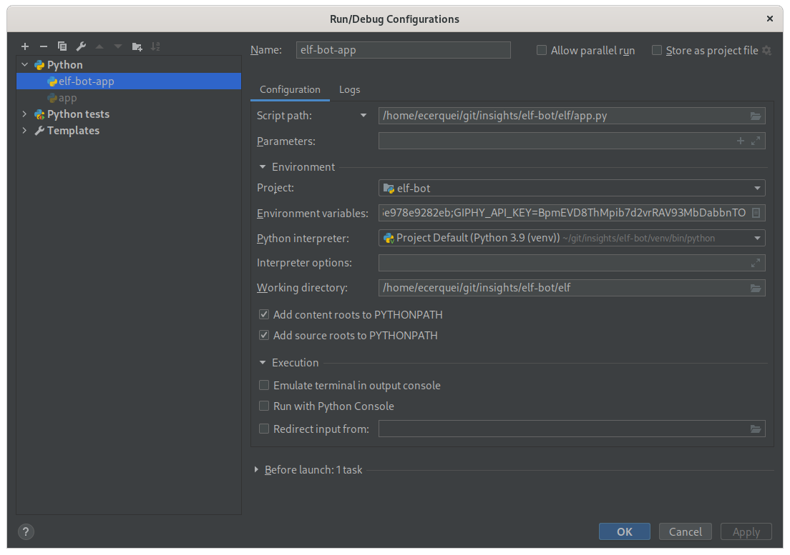
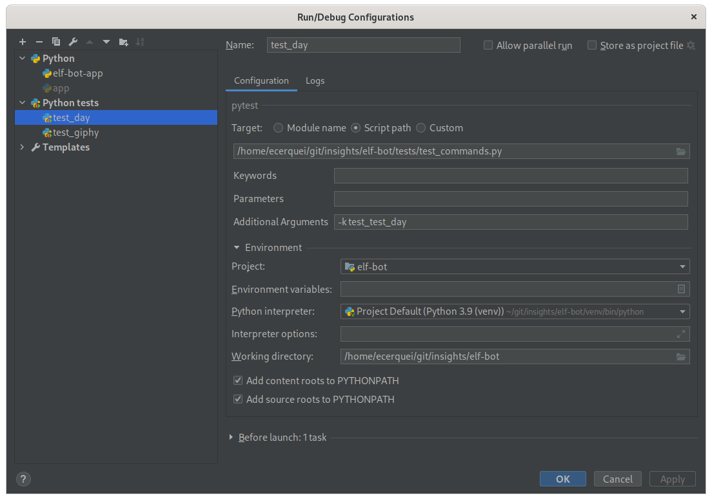

## run

pre-requisite:

* slack bot token and secret
* [smee-client](https://github.com/probot/smee-client)
* [smee-io channel](https://smee.io) same configured to elf application
* [npm](https://nodejs.org/)

install smee-client, on Linux:

```
sudo dnf install nodejs
npm install -g smee-client
```

set environment variables:

```
# env variables (token and log level)
export SLACK_BOT_TOKEN=*****
export SLACK_SIGNING_SECRET=*****
export SMEE_CHANNEL_ID=******
export LOG_LEVEL=INFO
```

run smee.io webhook and leave it running:

```
smee -u https://smee.io/$SMEE_CHANNEL_ID -t http://localhost:3000/slack/events
```

in other terminal start elf application:

```
cd elf-bot
python elf/app.py
```

### debugging

on Pycharm IDE set:





### contributing

check code lint before submitting your PR:

```
pre-commit run --all
```
